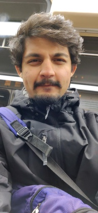
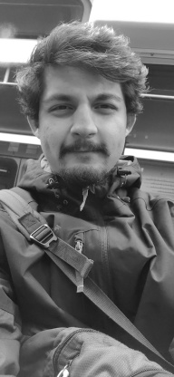
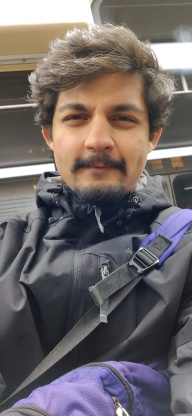
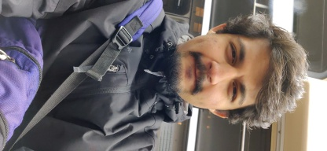
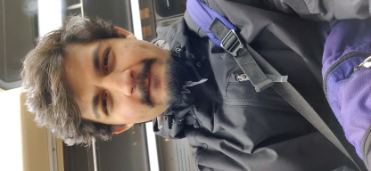
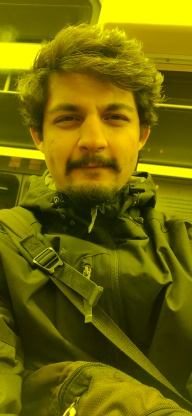

# OpenCV-fundamentals

<html>
<body>

 Shoumik Majumdar  
 29 Jan 2020 

<h2> Problem Definition </h2>

Create a grayscale image of your face by converting your color image. 
Flip your face image horizontally, i.e. left to right, right to left. 
Come up with a third way of manipulating your face that produces an interesting output. For example, you may create a blurred image of your grayscale face by assigning to each pixel the average grayscale pixel value of itself and its 8 neighbors. Hint: You may have to run your program a few times to make the blurring noticeable.

<h2> Method and Implementation </h2>

    I used the cv.imread() method provided by the openCV library to read the images.

    

    Greyscale:-
       To get the greyscale image, I took the mean of all the 3 channels for all image coordinates. I used the numpy function np.mean() to calculate the mean of all 3 channels. I assigned this mean to all 3 channels which created a greyscale image.
        

    

    Flip:-
        To flip the image, I created we simply transform the image matrix in such a way that I swap my first and last column, 2nd column with my 2nd last column and so on.
        

    

    Transpose_left:-
        To rotate the image to the left by 90 Degrees, I transposed the image array using python's transpose function.
        

    

    Transpose_right:-
        To rotate the image to the right by 90 Degrees, I flipped the image and transposed it.
        

    

    Tint:-
         To tint  the image, I set all the pixels of the Blue channel to 0.

<h2> Results</h2>

Following images were generated by using the above functions:

<table>
<tr><td colspan=3>
<h3>Results</h3>
</td></tr>
<tr>
<td> Trial </td><td> Source Image </td> <td> Result Image</td> 
</tr>
<tr>
  <td> Grayscale </td> 
  <td>  </td> 
  <td>  </td>
</tr> 
<tr>
  <td> Flipped Horizontal</td> 
  <td>  </td> 
  <td>  </td>
</tr> 
<tr>
  <td> Flipped Right</td> 
  <td>  </td> 
  <td>  </td>
</tr> 
<tr>
  <td> Flipped Left </td> 
  <td>  </td> 
  <td>  </td>
</tr> 
<tr>
  <td> Custom (Removed Blue channel)</td> 
  <td>  </td> 
  <td>  </td>
</tr> 

</table>

<h2> Conclusions </h2>

OpenCv reads images as Numpy Arrays which makes it easy to work with images at a pixel level. Applying transpormations becomes easier as it is the same is applying transformations to a matrix of numbers.
We can easily access each pixel and channel individually which makes it much easier to make changes to the images. Similarly if we want to flip the image, we simply swap column of our iamge matrix. 
    I would like to conclude by saying that OpenCv allows us to handle the images very easily.

</body>

</html>

